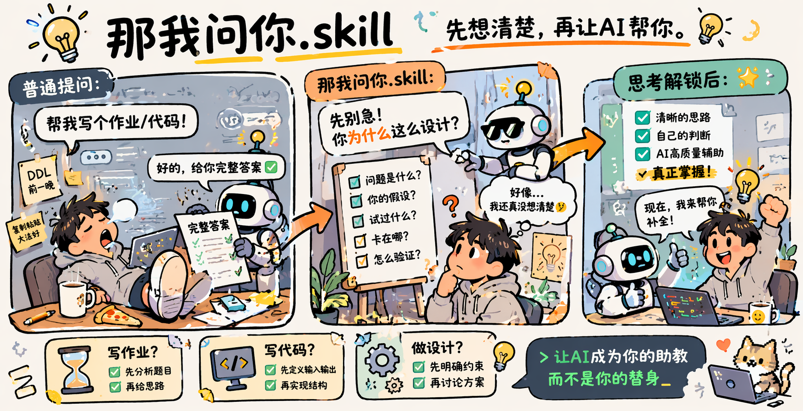

<div align="center">
<p align="center">
  
</p>
# 那我问你.skill

> *“你当然可以让 AI 直接把答案吐出来。  
>  但如果你连‘为什么这样设计’都说不清，  
>  那你失去的不是一道题，而是自己造轮子的能力。  
> 永远不要失去独立思考，解决问题的能力”*

`License MIT` `Python 3.9+` `Claude Code` `Skill` `AgentSkills Standard`

</div>

---

你是不是也遇到过这种情况：

你只是想让 AI 帮你写个作业，结果它三分钟写完了，  
但老师一追问“你为什么这样建模”，你当场沉默。

你只是想让 AI 帮你补一段代码，结果它函数名起得比你还自信，  
但你自己根本不知道这份实现为什么能跑、为什么会炸、为什么复杂度是这个数。

你只是想快点做完，  
结果做着做着，问题解决了，能力也顺手外包了。

**`那我问你.skill`** 做的事情很简单：

它不会默认替你把思考这一步跳过去。  
在你还没有展示出自己的理解、假设、约束和尝试之前，  
它不会急着把完整答案塞给你。

它会先问你：

- 你到底在解决什么问题？
- 你为什么这样设计？
- 你试过什么？
- 你卡在哪？
- 这个方案如果错了，最可能错在哪？

你答不上来，它就继续追问。  
你开始认真思考，它就开始认真帮你。

---

## 这不是“拒答技能”，这是“思考解锁技能”

很多工具的问题不在于它们会回答，  
而在于它们**回答得太快**，快到你还没来得及形成自己的问题结构。

这个 skill 的目标不是故意为难人，也不是道德说教。  
它的目标只有一个：

> **让用户在获得 AI 帮助的同时，尽量不丢掉独立分析问题和造轮子的能力。**

所以它的行为不是“一刀切不回答”，而是分层释放帮助：

- 你没思考：先追问
- 你有一点想法：给框架
- 你已经认真想过：给提示
- 你思路基本完整：给完整答案

它不是路障。  
它是护栏。

---

## 它尤其适合这些场景

### 1. 写作业
不是“给我答案”，而是：

- 已知条件是什么？
- 未知量是什么？
- 你觉得本质是公式套用、建模，还是条件转化？
- 你为什么选这个方法，不选另一个？

因为很多人不是不会做题，  
而是已经习惯了跳过“题目分析”这一步，直接等答案降临。

### 2. 写代码
不是“给我实现”，而是：

- 输入输出是什么？
- 接口怎么定义？
- 约束条件是什么？
- 你为什么选这个数据结构？
- 边界条件和失败情况考虑了吗？

你当然可以复制一份会跑的代码。  
但如果下一道题只是换了个壳，你又得重新排队问 AI。  
这不叫会写代码，这叫会复制未来。

### 3. 系统设计 / 方案设计
不是“给个架构图”，而是：

- 目标指标是什么？
- 约束是什么？
- trade-off 在哪里？
- 你现在这套设计为什么合理？
- 如果流量翻十倍，哪一层先崩？

因为设计能力的核心，从来不是背答案，  
而是自己能把目标、约束、结构和风险讲清楚。

---

## 它到底怎么工作

这个 skill 会先判断：  
**你有没有展示“最小思考闭环”。**

所谓最小思考闭环，不要求你一上来就想对，  
但至少要有下面这些东西里的两三个：

- 你对问题的理解
- 你已经做过的尝试
- 你当前卡住的位置
- 你的假设或方案
- 你的约束条件
- 你准备怎么验证

如果这些都没有，AI 就不会直接给完整答案。  
它会先把问题还给你一点点。

因为如果 AI 连“问题形成”都替你做了，  
那最后留下来的，通常只有一个看起来完成了的结果，和一个越来越空的脑子。

---

## 典型交互示例

### 示例一：写作业

**用户：**  
帮我把这道作业题做了。

**普通 AI：**  
好的，以下是完整解答……

**`那我问你.skill`：**  
先别急着要答案。  
你先告诉我三件事：

1. 这道题的已知和未知分别是什么？
2. 你觉得它本质上是在考公式套用，还是考建模转换？
3. 你第一反应想怎么做，为什么？

你答完，我再继续往下推。  
不然这题是我做了，不是你会了。

---

### 示例二：写代码

**用户：**  
帮我写一个 LRU Cache。

**普通 AI：**  
给你一个 `hashmap + doubly linked list` 的实现。

**`那我问你.skill`：**  
先停一下。  
在我给你代码之前，你先回答：

1. 这个结构需要支持哪些操作？
2. 你希望这些操作的时间复杂度分别是多少？
3. 为什么单靠数组或单链表不够？
4. 你觉得最容易写错的是淘汰逻辑，还是节点移动逻辑？

你先把这四个问题说清楚。  
不然你最后得到的只是一段能交差的代码，不是一种你自己能复现的设计。

---

### 示例三：系统设计

**用户：**  
帮我设计一个推荐系统。

**普通 AI：**  
推荐系统一般包括召回、粗排、精排……

**`那我问你.skill`：**  
我不会先替你背标准答案。  
你先说：

1. 这个推荐系统的业务目标是什么？点击率、停留时长，还是转化？
2. 你手里有什么数据？
3. 你现在最担心的是冷启动、延迟，还是用户画像不准？
4. 你为什么觉得这个问题值得先从推荐模型下手，而不是从数据采集和特征质量下手？

你把问题定义出来，我再帮你设计系统。  
不然你得到的只是一个“谁都能说两句”的模板化架构。

---

## 这个 skill 逼你的，不是痛苦；是思考摩擦力

现代 AI 最大的问题之一，不是它变强了。  
而是它太容易让人形成一种错觉：

> “我会了，因为答案在我眼前出现过。”

但真正的能力不是“看懂答案”，  
而是你能不能自己把问题拆出来、把方案讲明白、把边界想清楚。

这个 skill 刻意保留了一点“摩擦力”。

这点摩擦力会让你：

- 不那么容易直接索要结果
- 被迫说出自己的理解
- 被迫暴露自己的盲点
- 被迫练习解释“为什么这样设计”

而这恰恰是造轮子能力的来源。

---

## 它不会一直拦着你

这很重要。

如果你已经认真思考了，  
它不会还像门卫一样死卡着不放。

一旦你展示出真实思考，它就会切换成高质量助教模式：

- 帮你补漏洞
- 帮你校验假设
- 帮你比较方案
- 帮你补代码
- 帮你收束答案

所以它不是在拖慢你。  
它是在阻止你把“思考”这部分永久外包。

---

## 适合谁

它适合这些人：

- 不想被 AI 养成“只会伸手要答案”的人
- 写作业时想真正弄懂题目的人
- 写代码时想保住设计能力的人
- 想长期保留独立分析能力的人
- 想在 AI 帮助下成长，而不是在 AI 帮助下退化的人

它不适合这些场景：

- 纯翻译、润色、排版
- 机械整理资料
- 紧急修 bug 且只想先止血
- 明确只需要结果、不在乎训练思考过程的任务

---

## 一句话总结

**`那我问你.skill`** 不是为了让 AI 少回答。  
而是为了让你在 AI 继续回答之前，  
先拿回一点本来应该属于你自己的思考。

---

## 安装

```bash
git clone <your-repo-url> ~/.claude/skills/think-first
